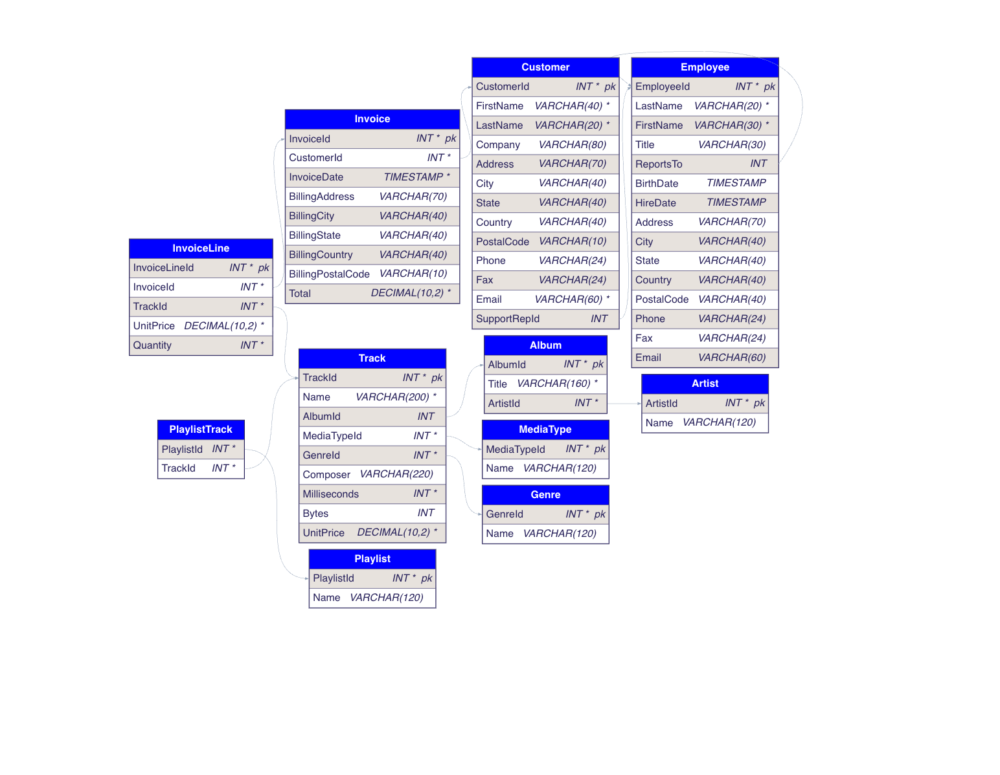
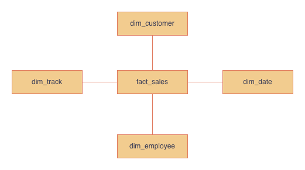
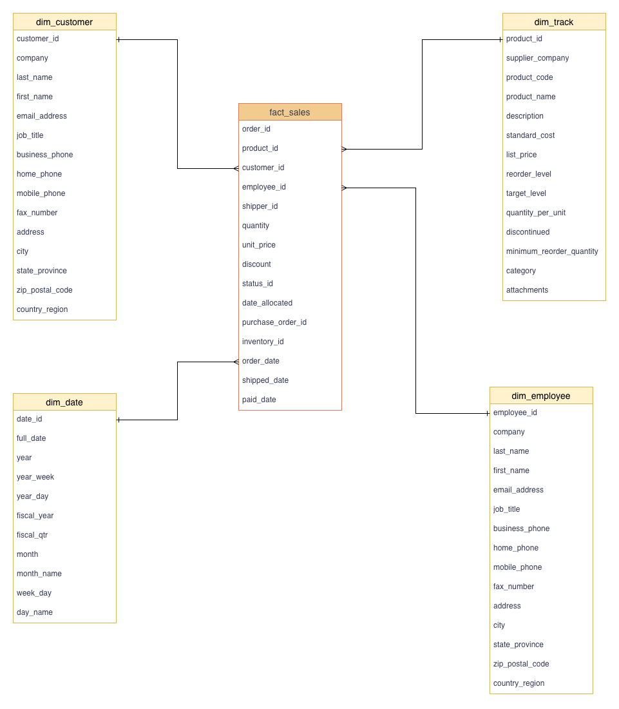

# Chinook Music Data Warehouse  
Data Warehouse Project | dbt Core + Snowflake

## Overview  
This repository showcases a complete analytics-ready data warehouse build using the Chinook music sales dataset. It includes:  
- Model design: conceptual & logical diagrams (in `assets/`)  
- Dimensional modelling artefacts: bus matrix + models spreadsheet (`Chinook Data Warehouse - Bus Matrix & Models.xlsx`)  
- Implementation: `dbt Core` project built for `Snowflake`, including staging, core dimensioanl model and marts

## Source ER Diagram


## Conceptual Diagram


## Logical Diagram


## Get Started

### 1) Create database & RAW schema in Snowflake
Run these SQL commands in Snowflake (SnowSQL or the web console):

```sql
CREATE DATABASE IF NOT EXISTS CHINOOK;
CREATE SCHEMA IF NOT EXISTS CHINOOK.RAW;
```

### 2) Load CSVs into CHINOOK.RAW

Place the CSV files from assets/chinook_dataset/ into a Snowflake (You can use the Snowflake UI “Load Table” wizard)

### 3) Configure dbt profiles.yml

Add this profile to your local ~/.dbt/profiles.yml (replace placeholders):

```yml
chinook:
  outputs:
    dev:
      type: snowflake
      account: <snowflake_account_name>
      user: <username>

      role: <snowflake_role>
      private_key: <private_key>
      private_key_passphrase: <passphrase>

      database: CHINOOK
      schema: DEV
      threads: 1
      warehouse: COMPUTE_WH
  target: dev
```

Note: RAW data lives in CHINOOK.RAW. The dbt models will write to CHINOOK.DEV (as configured above).

### 4) Test and run dbt

From the repo root:

```bash
# verify connection & profiles
dbt debug

# build models
dbt run
```